### 👋 Olá, eu sou o z-marcos-z!

<!-- Você pode editar as linhas abaixo com suas infos -->

🚀 Desenvolvedor apaixonado por criar experiências únicas  
🌌 Explorando o universo do código, uma commit de cada vez  
🐱 Cat lover & night coder  

---

### 🛠️ Tecnologias

---

### 📌 Projeto em destaque

---

✨ feito com código & café ✨

